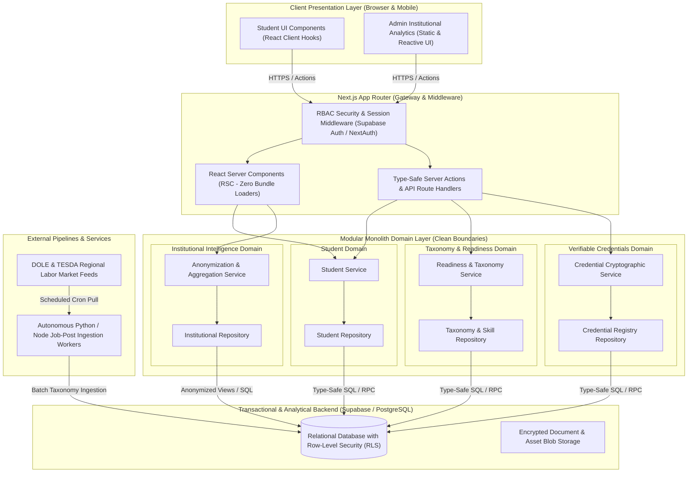

# RoarCast Target Software Architecture & Design Blueprint

**Document Version:** 1.0  
**Target Architecture Stage:** Pilot & Production Deployment  
**Author:** Antigravity (Senior Software Architect & Principal Systems Engineer)  
**System Evaluated:** RoarCast Platform (`blueztian/RoarCast`)

---

## 1. Executive Architectural Recommendation: The Modular Monolith

To smoothly transition RoarCast from an unverified frontend prototype into a resilient, secure, and verifiable workforce-intelligence platform for Santa Rosa, the engineering team must adopt a **Modular Monolith** architecture implemented upon a Next.js 14+ App Router runtime backed by a Supabase (PostgreSQL) cloud transactional database.

### Why a Modular Monolith is the Optimal Architecture for RoarCast
1. **Rejection of Premature Microservices:** Adopting distributed microservices, Kubernetes orchestration, or separate service deployments for a student pilot introduces debilitating operational complexity, network latency, distributed transaction failures, and infrastructure overhead. A lean engineering team must avoid premature distribution.
2. **High Domain Cohesion with Zero Latency:** A Modular Monolith keeps related business domains (Student Readiness, Industry Taxonomy, Upskilling Squads, Verifiable Credentials, and Institutional Admin Intelligence) running within a unified server runtime while enforcing strict code-level boundary interfaces and independent domain schemas.
3. **Seamless Full-Stack TypeScript Integration:** Leveraging Next.js React Server Components (RSC) and Server Actions enables zero-bundle-overhead domain execution, secure server-side secrets management, and type-safe end-to-end data communication across frontend UI components and backend relational databases.
4. **Pragmatic Path to Future Scale:** A cleanly layered modular monolith—where domains communicate through explicit Service & Repository interfaces rather than tangled global imports—can be easily carved into isolated cloud workers or dedicated microservices if future city-wide traffic volumes demand it.

---

## 2. Recommended Target Architecture Diagram (Mermaid)



---

## 3. Proposed Project & Folder Structure

To eliminate architectural divergence, enforce separation of concerns, and clean up workspace debris, the repository should be reorganized into an explicit domain-driven source framework:

```
RoarCast/
├── .github/                   # CI/CD pipelines, issue templates, and automated verification workflows
├── data-engine/               # Autonomous serverless background ingestion scripts (PEZA/TESDA scraping)
├── docs/                      # Architectural Decision Records (ADRs), API schemas, and test plans
├── public/                      # Static branding imagery, favicon, and visual assets
├── src/
│   ├── app/                     # Next.js App Router (Strictly lightweight presentation routes)
│   │   ├── (public)/            # Marketing landing, public Triple-Helix overview, and onboarding login
│   │   ├── (student)/           # Student application routes (Dashboard, Explore, Learn, Credentials)
│   │   ├── admin/               # Protected institutional analytics routes (Academe, PESO, PEZA Zones)
│   │   ├── api/                 # Webhook receivers and external REST integration handlers
│   │   ├── layout.tsx           # Global font loading and application root metadata
│   │   └── middleware.ts        # Edge auth session interception and role-based route locking
│   │
│   ├── components/              # Reusable design pattern components and token styles
│   │   ├── ui/                  # Atomic presentation elements (Buttons, Inputs, Badges, Modals)
│   │   ├── charts/              # Accessible SVG and analytical chart visualization components
│   │   └── layout/              # Responsive navigation shells, floating headers, and mobile bars
│   │
│   ├── domains/                 # Core Modular Monolith Business Logic (Zero presentation JSX)
│   │   ├── student/             # Student onboarding, profiles, and upskilling squad state rules
│   │   ├── taxonomy/            # Skill taxonomy mapping, micro-audit scoring, and gap calculations
│   │   ├── credentials/         # W3C verifiable credential issuance and QR cryptographic verifications
│   │   └── intelligence/        # Institutional data aggregation and k-anonymity filtering algorithms
│   │
│   ├── infrastructure/          # External adapters and persistence infrastructure implementations
│   │   ├── db/                  # Supabase database client initializers and SQL schema types
│   │   ├── auth/                # Identity provider configuration and encryption session helpers
│   │   └── repositories/        # Concrete implementation of domain storage persistence repositories
│   │
│   └── shared/                  # Utilities, domain invariants, configuration parsers, and type generics
│       ├── config/              # Environment variable validators and feature flag definitions
│       ├── errors/              # Custom application error hierarchies and exception mappers
│       └── utils/               # Pure helper calculations, date formatters, and regex utilities
│
├── tests/                     # Test fixtures, mock databases, unit suites, and E2E automation scripts
├── package.json               # Package dependency configuration and NPM deployment scripts
└── tsconfig.json              # TypeScript strict checking compilation settings
```

---

## 4. Domain, Data-Access, Service, & Repository Boundaries

To reverse existing violations of Dependency Inversion and Open/Closed principles, code interactions must follow a strict one-way dependency flow: **Presentation UI $\rightarrow$ Domain Services $\rightarrow$ Repository Interfaces $\rightarrow$ Concrete Database Adapters**.

### 4.1 Domain Boundaries
1. **Student Domain (`src/domains/student/`):** Manages user registration, academic specialization profile attributes, and collaborative squad formation. Cannot import from or directly query Admin Analytics or Data Engine components.
2. **Taxonomy & Readiness Domain (`src/domains/taxonomy/`):** Houses core evaluation engines, including the 60-second micro-audit grading algorithms, skill tag mappings against DOLE/TESDA regional baselines, and mathematical readiness derivations.
3. **Credentials Domain (`src/domains/credentials/`):** Regulated boundary responsible for generating W3C-compliant JSON-LD credential structures, assigning unique cryptographic serial hashes, and producing scannable verification payloads.
4. **Institutional Intelligence Domain (`src/domains/intelligence/`):** Dedicated analytics domain responsible for executing differential privacy rules and aggregating student metrics before exposing statistical insights to Academe and PESO dashboards.

### 4.2 Service & Repository Pattern Implementation
*   **Domain Services:** Contain pure business logic and operational invariant checks (e.g., verifying that a student has completed all required learning modules before initiating credential issuance). Services never execute raw SQL or call browser APIs directly.
*   **Repository Pattern:** Define contract interfaces inside domain directories (`export interface StudentRepository { findById(id: string): Promise<Student>; save(student: Student): Promise<void>; }`). Concrete database adapters inside `src/infrastructure/repositories/` implement these interfaces using verified Supabase SQL queries or transactional ORM calls.

---

## 5. State-Management, Authentication, & Security Strategy

### 5.1 Pragmatic State Management
*   **Abandon Direct LocalStorage:** Remove all direct invocations of `window.localStorage` from domain helpers and application pages.
*   **Server State (Primary Truth):** Treat relational database state (PostgreSQL) as the single source of truth. Rely on Next.js Server Components and React Server Actions to fetch, revalidate, and cache server data across application routes without complex global client stores.
*   **Client State (UI Only):** Limit client-side React state (`useState`, `useReducer`, or localized React Context) exclusively to temporary visual interface controls—such as active form inputs, open drawers, and Framer Motion animation sequence ticks.

### 5.2 Secure Authentication & Authorization Strategy
*   **Identity Provider Integration:** Integrate **Supabase Auth** (or NextAuth.js configured with secure cryptographic JWT signing) to handle multi-tenant credential verification and token issuance.
*   **Edge Middleware Enforcing Role-Based Access Control (RBAC):** Deploy a global root middleware interceptor (`src/app/middleware.ts`) that verifies session signatures before rendering route payloads:
    *   `app/(student)/*`: Requires an active student authentication token.
    *   `app/admin/*`: Strictly asserts admin institutional claims (`token.role === 'academe' | 'peso' | 'superadmin'`); instantly redirects unauthenticated traffic to `/login`.
*   **Row-Level Security (RLS):** Configure Supabase PostgreSQL Row-Level Security policies ensuring database engines physically reject unauthorized query attempts, guaranteeing that students can never query institutional analytics tables or modify unearned credential ledgers.

---

## 6. Relational Data Model & Schema Recommendations

To transition from unvalidated client-side demo arrays to a robust, normalized transactional engine, RoarCast should provision the following PostgreSQL schema definitions:

```sql
-- Core user accounts linked to authentication identity provider
CREATE TABLE users (
    id UUID PRIMARY KEY DEFAULT gen_random_uuid(),
    email VARCHAR(255) UNIQUE NOT NULL,
    role VARCHAR(32) NOT NULL CHECK (role IN ('student', 'academe', 'peso', 'admin')),
    created_at TIMESTAMP WITH TIME ZONE DEFAULT timezone('utc', now())
);

-- Student specialization profiles and target alignment
CREATE TABLE student_profiles (
    user_id UUID PRIMARY KEY REFERENCES users(id) ON DELETE CASCADE,
    full_name VARCHAR(128) NOT NULL,
    age INTEGER NOT NULL CHECK (age >= 15 AND age <= 80),
    school_name VARCHAR(255) NOT NULL,
    degree_program VARCHAR(255) NOT NULL,
    expected_graduation_year INTEGER NOT NULL,
    target_career_path VARCHAR(128) NOT NULL,
    readiness_score INTEGER NOT NULL DEFAULT 0 CHECK (readiness_score >= 0 AND readiness_score <= 100),
    updated_at TIMESTAMP WITH TIME ZONE DEFAULT timezone('utc', now())
);

-- Dynamic regional skill taxonomy populated by Data Engine
CREATE TABLE skill_taxonomy (
    id VARCHAR(64) PRIMARY KEY,
    skill_name VARCHAR(128) UNIQUE NOT NULL,
    sector VARCHAR(128) NOT NULL,
    current_demand_trend VARCHAR(32) NOT NULL CHECK (current_demand_trend IN ('high', 'rising', 'steady')),
    dole_tesda_alignment_code VARCHAR(64),
    description TEXT NOT NULL
);

-- Student micro-audit assessment responses and skill gap analysis
CREATE TABLE audit_assessments (
    id UUID PRIMARY KEY DEFAULT gen_random_uuid(),
    student_id UUID NOT NULL REFERENCES student_profiles(user_id) ON DELETE CASCADE,
    computed_readiness INTEGER NOT NULL,
    priority_gap_skill_id VARCHAR(64) REFERENCES skill_taxonomy(id),
    completed_at TIMESTAMP WITH TIME ZONE DEFAULT timezone('utc', now())
);

-- Cryptographically verifiable professional credentials
CREATE TABLE verifiable_credentials (
    id UUID PRIMARY KEY DEFAULT gen_random_uuid(),
    credential_serial VARCHAR(128) UNIQUE NOT NULL,
    student_id UUID NOT NULL REFERENCES student_profiles(user_id) ON DELETE CASCADE,
    skill_id VARCHAR(64) NOT NULL REFERENCES skill_taxonomy(id),
    issuer_name VARCHAR(255) NOT NULL DEFAULT 'RoarCast Workforce Intelligence',
    cryptographic_signature TEXT NOT NULL,
    issued_at TIMESTAMP WITH TIME ZONE DEFAULT timezone('utc', now())
);
```

---

## 7. Testing, Observability, & Backend Transition Strategy

### 7.1 Testing Pyramid Implementation
*   **Unit Tests (70% Allocation):** Execute rapid TypeScript verification using `Vitest`. Focus test coverage on pure domain calculation algorithms—verifying micro-audit scoring thresholds, learning progress calculation formulas, and k-anonymity aggregation functions.
*   **Component & Integration Tests (20% Allocation):** Implement `React Testing Library` to verify that design elements (e.g., `ReadinessRing`, `SkillGapCard`) render correct visual hierarchies and accessibility ARIA labels when injected with domain mock data.
*   **End-to-End (E2E) Automation (10% Allocation):** Deploy `Playwright` to run automated browser scripts verifying complete user paths: Student Registration $\rightarrow$ 60-Second Micro-Audit Completion $\rightarrow$ Readiness Dashboard Visualization $\rightarrow$ Scannable QR Credential Verification.

### 7.2 Lean Pilot Observability
To monitor runtime health during controlled Santa Rosa pilot deployments without overengineering:
*   **Structured Logging:** Replace arbitrary console debugging with structured JSON error logging (`pino` or `next-logger`), embedding unique correlation request timestamps and user role tokens.
*   **Exception Tracking:** Integrate a lightweight exception monitoring adapter (such as Sentry or OpenTelemetry crash reporting) to capture runtime hydration failures and backend query exceptions.

### 7.3 Phased Backend Transition Methodology
To safely convert the existing frontend demo into this modular monolith architecture without destroying visible demonstration integrity:
1. **Interface Definition Layering:** Keep existing UI components intact, but extract direct local storage reads into async domain repository abstractions (`StudentRepository.getProfile()`).
2. **Dual-Adapter Configuration:** Provide two implementations of each repository interface: a legacy `LocalStorageStudentRepository` (for offline presentations) and a transactional `SupabaseStudentRepository` (for verified production pilot runs).
3. **Environment Switchover:** Use validated environment variables (`NEXT_PUBLIC_DATA_ADAPTER="supabase"`) to seamlessly flip application runtime persistence from browser local storage to live cloud database tables upon completing unit test verification.

---
*End of Architecture Blueprint.*
